

I've been 3d printing labware since my PhD, as it's a cheap, quick, and convenient way to produce exactly what's needed at the bench. These are a selection of the 3d printing files I've generated for use in the lab, made available for others to download, edit, print, and use. They're designed in TinkerCAD, usually in a modular format that allows quick customisation for specific lab roles.

| Print | Details |
|:-----:|:-----:|
| 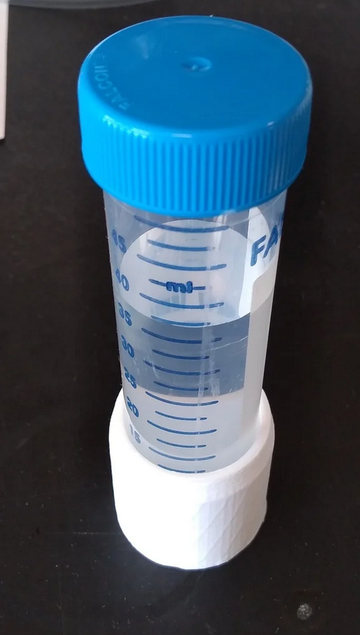 | **50 ml conical centrifuge single tube holder**    \|  |
| 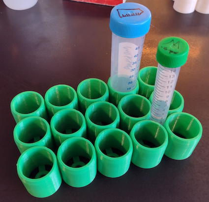 | **50 ml (and 15 ml) conical tube rack**    \|  |
| 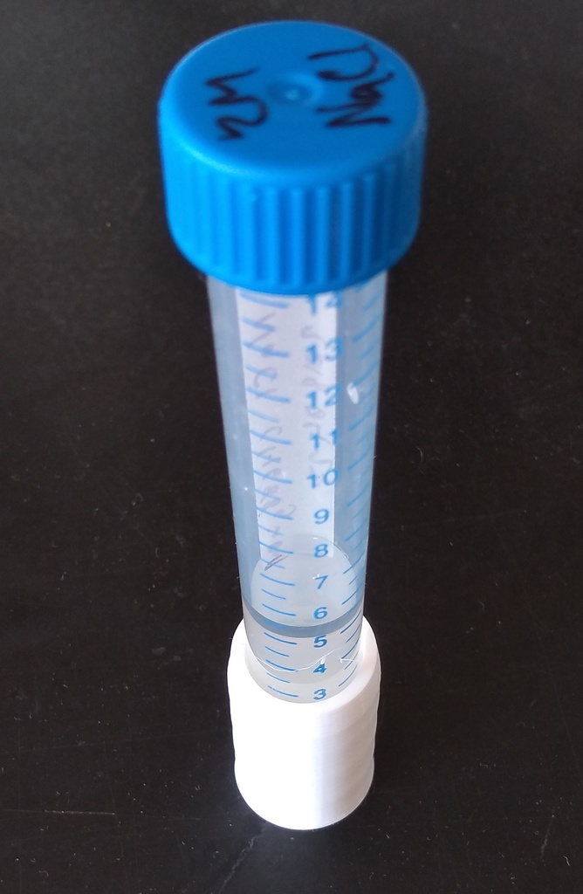 | **15 ml conical centrifuge single tube holder**    \|  |
| 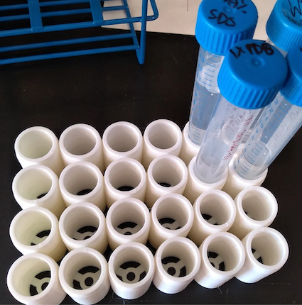 | **15 ml conical tube rack - 24 well plate layout**    \|  |
| 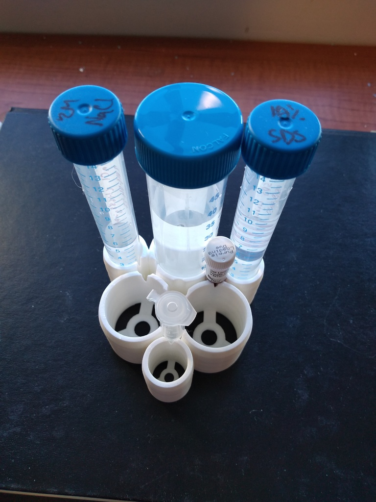 | **15/50 ml conical tube rack - 3x each**    \|  |
| 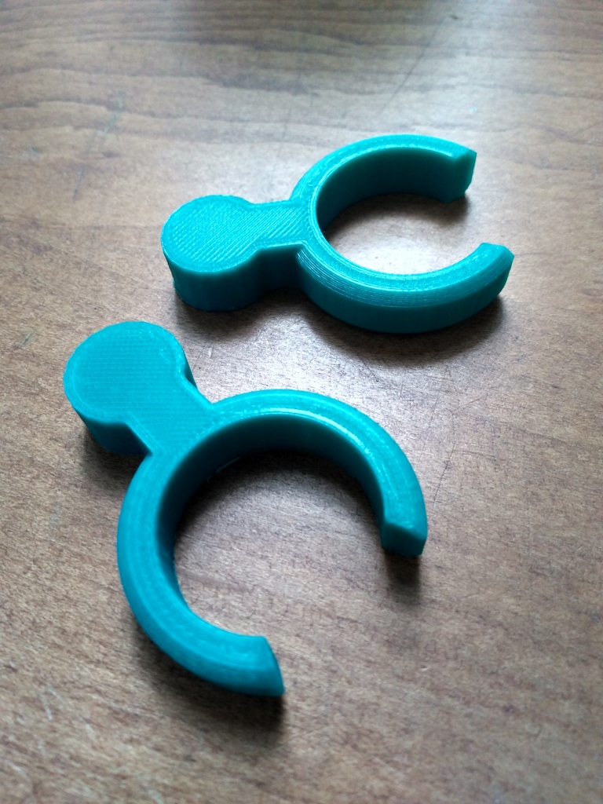 | **15 to 50 ml tube rotator converter**    \|  |
| 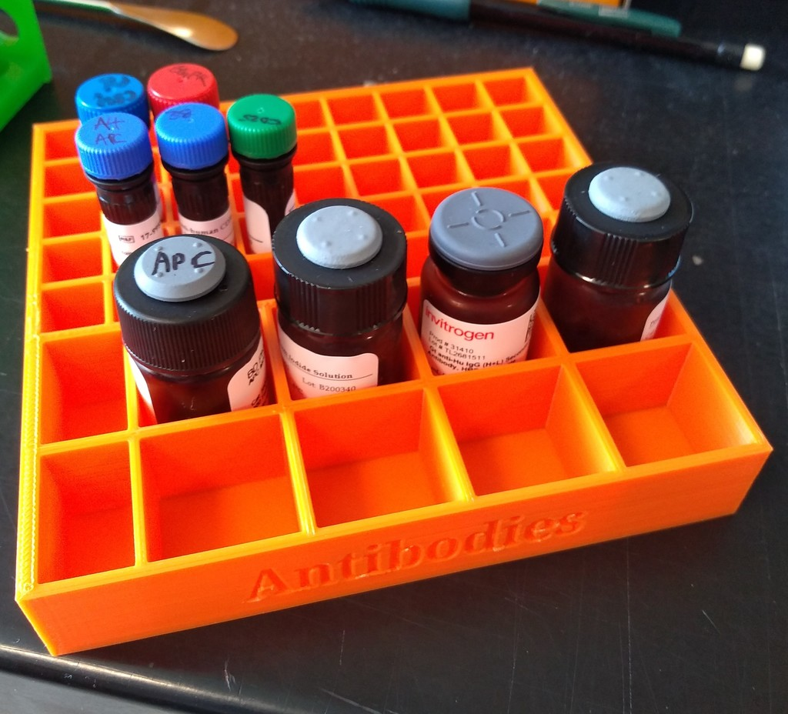 | **Antibody fridge storage rack**    \|  |
| 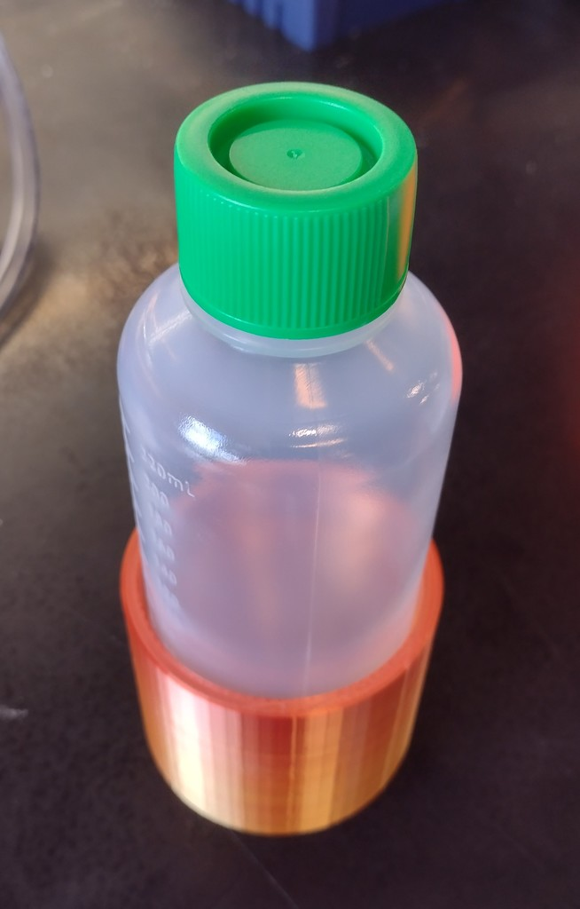 | **250 ml conical centrifuge single tube holder**    \|  |
| 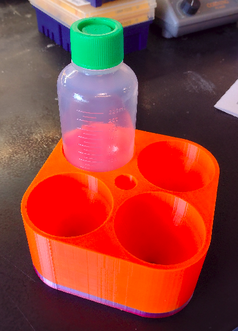 | **250 ml conical centrifuge 4 tube rack**    \|  |
| 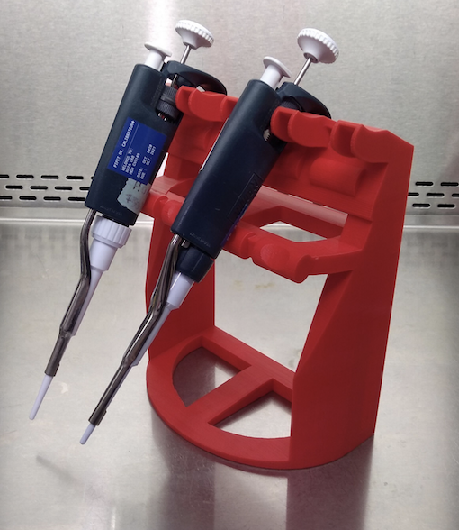 | **Free standing pipette rack**    \|  |
| 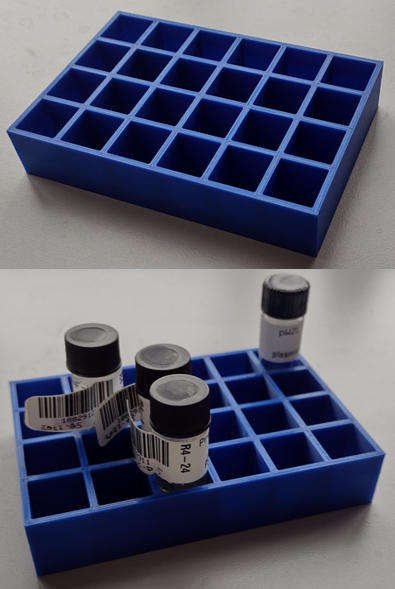 | **14 mm vial/tube rack - Addgene stab storage**    \|  |
| 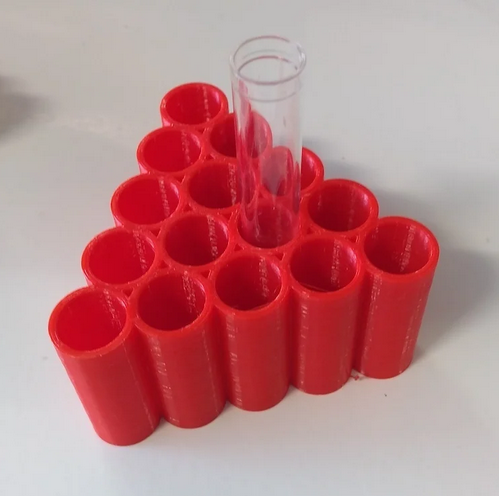 | **5 ml FACS tube rack - 15 tubes**    \|  |
| 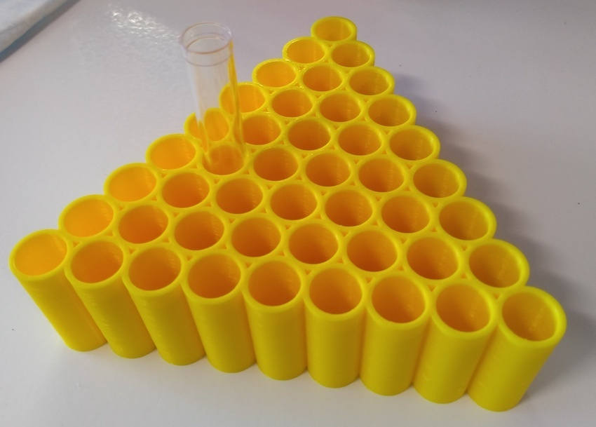 | **5 ml FACS tube rack - 45 tubes**    \|  |

Alternatively all of my public designs can be found [on my Thingiverse page](https://www.thingiverse.com/jamimmunology/designs).

Note that these are shared here under a CC BY-NC-SA license, however certain models are available under a less restrictive license from Thingiverse.
